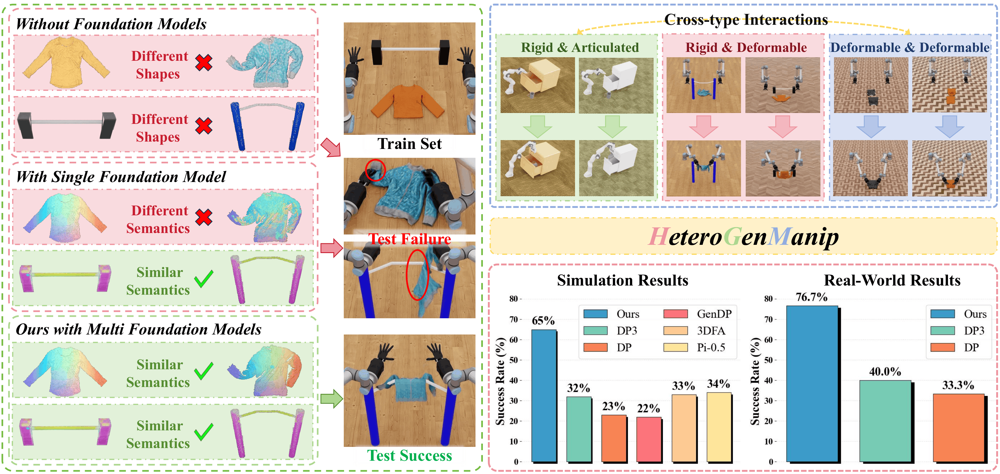

<h1 align="center">
HeteroGenManip:
<br>
Generalizable Manipulation For<br>
Heterogeneous Object Interactions
</h1>

<div align="center">
    <a href="" target="_blank">
    </a>
    <a href="" target="_blank">
    </a>
    <a href="https://github.com/YzmYalier/HeteroGenManip" target="_blank">
    </a>
    <a href="https://huggingface.co/datasets/wayrise/DexGarmentLab/tree/main" target="_blank">
    </a>
</div>



HeteroGenManip is a task-conditioned, two-stage framework designed to decouple initial grasp from complex interaction execution. First, Foundation-Correspondence-Guided Grasp module leverages structural priors to align the initial contact state, thereby significantly reducing the pose uncertainty of grasping. Subsequently, Multi-Foundation-Model Diffusion Policy (MFMDP) routes objects to category-specialized foundation models, integrating fine-grained geometric information with highly-variable part features via a dual-stream cross-attention mechanism.
## Installation

### Step1: Install NVIDIA Isaac Sim 4.5
You can follow the [official guidance](https://docs.isaacsim.omniverse.nvidia.com/4.5.0/installation/install_python.html). We recommend you to install using PIP. We show this step as follows:

```bash
conda create -n MFMDP python=3.10 # create conda env
conda activate MFMDP
```

```bash
pip install isaacsim[all]==4.5.0 --extra-index-url https://pypi.nvidia.com
pip install isaacsim[extscache]==4.5.0 --extra-index-url https://pypi.nvidia.com
```

### Step2: Install Other Dependeces

Install pointnet2_ops:

```bash
cd /path/to/a/tmp/directory
git clone https://github.com/erikwijmans/Pointnet2_PyTorch.git
cd Pointnet2_PyTorch/
```

You may have to adjust `TORCH_CUDA_ARCH_LIST` in `Pointnet2_PyTorch` source code considering your GPU architecture.

```bash
pip install pointnet2_ops_lib/ --no-build-isolation
```

Install requirements.txt in our repository

```bash
git clone https://github.com/YzmYalier/HeteroGenManip.git
cd HeteroGenManip
pip install -r requirements.txt
```

### Step3: Get Uni3D Model

We downloaded and used [uni3d-b](https://huggingface.co/BAAI/Uni3D/blob/main/modelzoo/uni3d-b/model.pt) as the pretrained weights for Uni3D.
You can download it to `FoundationModels/Uni3D/logs/model.pt`

### Step4: Get Assets

You can download our assets from [huggingface](https://huggingface.co/datasets/yydsyangsdyy/HeteroGenManip), and put dir `Assets` to current path.

## Usage

### Data Collection

We present 6 tasks on NVIDIA Isaac Sim 4.5: Hang_Coat, Hang_Tops, Store_Tops, Stack_Tops, Wear_Bowlhat, Store_Mug. You can collect data by running following command:

```bash
bash Data_Collection.sh ${task_name} ${data_num}
# Example: bash Data_Collection.sh Hang_Coat 50
```

Then saved data and videos can be found in `Data` directory.

### Train Our Framework

After data collection, you can train our framework by running following command:

```bash
bash Train.sh ${task_name} ${data_num}
# Example: bash train.sh Hang_Coat 50
```

We tested this command on NVIDIA RTX 4090 24GB GPU. If you would like to adjust VRAM usage, you can change batch_size in `MFMDP/multi_foundation_model_diffusion_policy/config/${task_name}_mfmdp.yaml`

### Evaluate Our Framework

After train our framework, you can evaluate our framework by running following command:

```bash
bash Evaluation.sh ${task_name}_ind ${validation_num} ${training_data_num} ${checkpoint_num} MFMDP # Evaluate on train setting
bash Evaluation.sh ${task_name}_ood ${validation_num} ${training_data_num} ${checkpoint_num} MFMDP # Evaluate on test setting

# Example: bash Evaluation.sh Hang_Coat_ind 50 50 3000 MFMDP && bash Evaluation.sh Hang_Coat_ood 50 50 3000 MFMDP
```

## License
This code base is released under the MIT License (refer to the LICENSE file for details).

## Acknowledgement
Parts of this codebase have been adapted from [DexGarmentLab](https://github.com/wayrise/DexGarmentLab) and [Uni3D](https://github.com/baaivision/Uni3D).